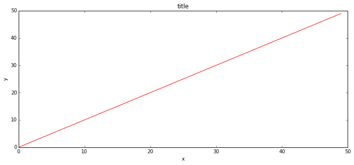

Work Notes
==========

Objective
---------

My objective for this effort is to demonstrate my data processing and analysis
capabilities outside of my tradiational hyperspectral remote sensing work.  I
have played in that arena for a long time and picked up a good number of
modeling and analysis skills.  This present effort is meant to be a quick
example of processing unfamiliar data using new tools and protocols.  This work
needs to be quick, efficient, and have a clear punch line.

I made a statement a few days ago that I would like to solve new types of
problems.  Foe example, I
might treat a new movie as a collection of word feature vectors pulled out of a
Twitter feed.  I
would then make statistical associations with other movies having known
performance characteristics
such as viewer retention and engagement.  The validity of the association
process could be verified
by testing with lablled data.  Results from such a process might be useful for
someones planning
efforts.

Early Morning Thinking
----------------------

Very early this morning I could not sleep as I kept thinking about this effort.
I kept reviewing
in my head details of the objective in the section above.  I need a way to make
sense of text
describing a movie.  A quick search on Github turned up this great Python
package:
[TextBlob](https://github.com/sloria/TextBlob).  The text from the website says:

    A library for processing textual data. It provides a simple API for diving
into common natural
    language processing (NLP) tasks such as part-of-speech tagging, noun phrase
extraction,
    sentiment analysis, classification, translation, and more.

Behind the scenes it uses [NLTK](http://www.nltk.org/) and
[patterns](http://www.clips.ua.ac.be/pages/pattern-en).  I've have not done much
with natural
language text processing.  This tools will be a great place to start!

I found a nice web API for querrying information from IMDb and RottenTomatoes:
[The OMDb API](http://www.omdbapi.com/).  For example, this query for
information about the movie
Star Wars, `http://www.omdbapi.com/?s=Star%20Wars` yields this JSON response:

    {"Search": [{"Title": "Star Wars", "Year": "1977",
                 "imdbID": "tt0076759", "Type": "movie"},
                {"Title": "Star Wars: Episode V - The Empire Strikes Back",
"Year": "1980",
                 "imdbID": "tt0080684", "Type": "movie"},
                {"Title": "Star Wars: Episode VI - Return of the Jedi", "Year":
"1983",
                 "imdbID": "tt0086190", "Type": "movie"},
                {"Title": "Star Wars: Episode I - The Phantom Menace", "Year":
"1999",
                 "imdbID": "tt0120915", "Type": "movie"},
                {"Title": "Star Wars: Episode III - Revenge of the Sith",
"Year": "2005",
                 "imdbID": "tt0121766", "Type": "movie"},
                {"Title": "Star Wars: Episode II - Attack of the Clones",
"Year": "2002",
                 "imdbID": "tt0121765", "Type": "movie"},
                {"Title": "Star Wars: The Clone Wars", "Year": "2008",
                 "imdbID": "tt1185834", "Type": "movie"},
                {"Title": "Star Wars: The Clone Wars", "Year": "2008",
                "imdbID": "tt0458290", "Type": "series"},
                {"Title": "Star Wars: Clone Wars", "Year": "2003",
                 "imdbID": "tt0361243", "Type": "series"},
                {"Title": "The Star Wars Holiday Special", "Year": "1978",
                 "imdbID": "tt0193524", "Type": "movie"}]}

Its just a bit more work to also retrieve information from RottenTomatoes using
the imdbID as a
reference number.

I found several Python packages on Github for Twitter's API service, here are
two that seem well-maintained: https://github.com/geduldig/TwitterAPI and
https://github.com/ryanmcgrath/twython.  Just from reading over each package, I
really like Twython's minimalistic interface.  I will probably go with that.

Next I wanted a list of interesting movies to play with.  I found this list of
titles from 2012 for
sequels of popular movies: [Sequel Movies
2012](http://www.movieinsider.com/movies/sequel/2012).  I
figure I'll need to manipulate some of that data by hand just to get it done
quickly.  I would
normally write some code to automate this step, but right now this is a one-time
deal.

Comparing Words
---------------

Once the data is all assembled into a useable form, then I plan to compare words
using the [Bag-of-Words](http://en.wikipedia.org/wiki/Bag-of-words_model)
approach.  This involves computing histograms of word frequencies for some
ensemble of words (e.g. words collected from Tweets).  There are several ways to
compare histograms with the goal of computing a similarity metric.  My favorite
is the [Earth-Mover
distance](http://en.wikipedia.org/wiki/Earth_mover's_distance).  It's like this:
given two diffrent histograms with the same bins, think of the two distributions
as two piles of dirt.  Then the EMD metric is the minimum amount of work a
bulldozer have to do in order to make one pile of counts look like the other.
Last year I wrapped up this [Fast C++
EMD](http://www.seas.upenn.edu/~ofirpele/FastEMD/code/) implementation as a
Python extension for another project.  In this other project the distance
between bins was simple: just the [Euclidean
distance](http://en.wikipedia.org/wiki/Euclidean_distance) between them in bin
space.

Now in this task I am dealing with words as labels for each bin.  There is no
physical meaning associated with which word is handled in the adjacent bin.  The
words might be sorted alphabetically, or by size, or just at random.  About ten
years ago I implemented the [Levenshtein
Distance](http://en.wikipedia.org/wiki/Levenshtein_distance) in
[IDL](http://www.exelisvis.com/ProductsServices/IDL.aspx), way before I ever
started using Python.  I could translate that version over to Python, but it was
actually easier to just go Googling for a Python implementation. One of the
first results on my page was: [py-editdist](https://code.google.com/p/py-
editdist/).  This package has a single easy-to-use function:

    import editdist
    
    d1 = editdist.distance('abcd', 'abcd')
    d2 = editdist.distance('abcd', 'abcf')
    d3 = editdist.distance('abcd', 'ah!')
    d4 = editdist.distance('abcd', 'eh!')
    d5 = editdist.distance('abcd', 'trampoline')
    
    print(d1, d2, d3, d4, d5)

    (0, 1, 3, 4, 9)

The idea here is to compute a cost metric between all pairs of words used in
this analysis.  So let's says my complete list of words is this:

    words = ['apple', 'pear', 'peach', 'banana', 'raspberry']

I can next compute the edit distance between all word pairs as:

    N = len(words)
    cost = np.zeros((N, N))
    
    for i in range(N):
        w_i = words[i]
        for j in range(N):
            w_j = words[j]
            
            dist_ij = editdist.distance(w_i, w_j)
            cost[i, j] = dist_ij

    cost

    array([[ 0.,  4.,  5.,  5.,  6.],
           [ 4.,  0.,  2.,  5.,  6.],
           [ 5.,  2.,  0.,  5.,  7.],
           [ 5.,  5.,  5.,  0.,  8.],
           [ 6.,  6.,  7.,  8.,  0.]])

The symmetric array above shows the number of character edits it will take to
make the $i^{th}$ word in my set look like the $j^{th}$ word. For example, it
takes 4 edits to make the word `"raspberry"` ($i=4$) look like `"peach"`
($j=2$).

Work Plan
---------

Focus on acquiring data from various sources and aggregate into a form suitable
for visualization and analysis.  I don't think I'll have today for any
exhaustive analysis.  The most I want to get done today is a nice visualization
that will make it clear something smart can be done with the data.

1. Install necesary packages.
2. Get Twitter feed connected and running: Oauth2, API key, etc.
3. Browse through the Sequel Movies 2012 web site and make a list of interesting
movies to play with.
4. Automate looking up movie details from OMDb site.  I want information about
IMDbID, plus RottenTomatoes user feedback.
5. Work with Twitter API.  I want to search for each of these movies over two
time periods: a few months prior to release data, and a few months just after
release date.
6. Apply TextBlob methods to text data pulled from RottenTomatoes and from
Twitter search results.  TextBlob will return two metrics describing the
sentiment of a chunk of text: **Polarity** and **Subjectivity**.  Those two
numbers will be a great starting point for visualizing this stuff.
7. Aggregate Twitter text for each movie (keeping before and after sets
separate).  Compute histograms of occurance of each word as basis for [Bag-of-
Words](http://en.wikipedia.org/wiki/Bag-of-words_model) style model for cross-
comparing multiple sets of words.

    %matplotlib inline

    fig, axes = plt.subplots(figsize=(12,5))
    
    axes.plot(range(50), 'r')
    axes.set_xlabel('x')
    axes.set_ylabel('y')
    axes.set_title('title')

    <matplotlib.text.Text at 0x45cb310>

    
